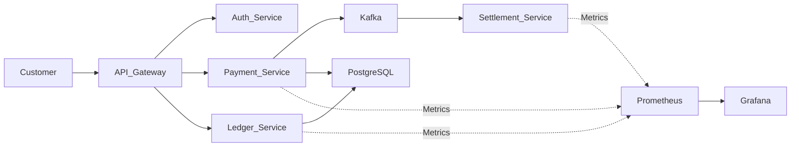

# Architecture Diagram


```
```
# Technology Choices
### Why ArgoCD instead of Flux? <br>
Good question. Initally going into this, I thought "I already have a lot of experience using Flux as I use it in my everyday work life" so I wanted to try out ArgoCD, gain some new experience and see what it offers that I can't get from Flux.

### Why EKS instead of self-managed Kubernetes? <br>
Well it was really a preference thing. For somone predominantly using AWS as their preferred cloud provider, it makes a lot of sense to use EKS. An AWS-managed cluster privides easier access to vast number of other resources provided by AWS. Like ALB contoller, external DNS, EBS CSI controllers just to mention a few. Similarly, if I was an Azure fanatic as much as i am with AWS, I probably would be using AKS. I would really on find myself pivoting towards self-managed Kubernetes clusters when I am using a service provider that only gives me access to cloud servers.

### How did you define SLOs? <br>

### How did you handle secrets? <br>

### What happened during your network partition test? <br>

### What was your MTTR? <br>

### How did you implement policy enforcement? <br>


# Project Goals

What I was aiming for with this project is supporting a simulated payment-processing ecosystem with GitOps, policy-as-code, OpenTelemetry tracing, SLO-driven observability, chaos engineering, and automated service onboarding. With proper handling of failure scenerios.